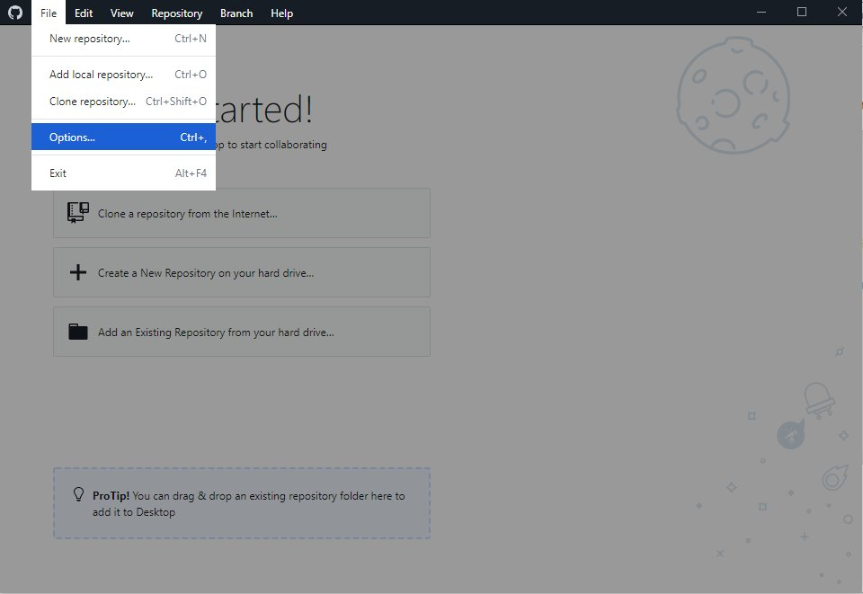
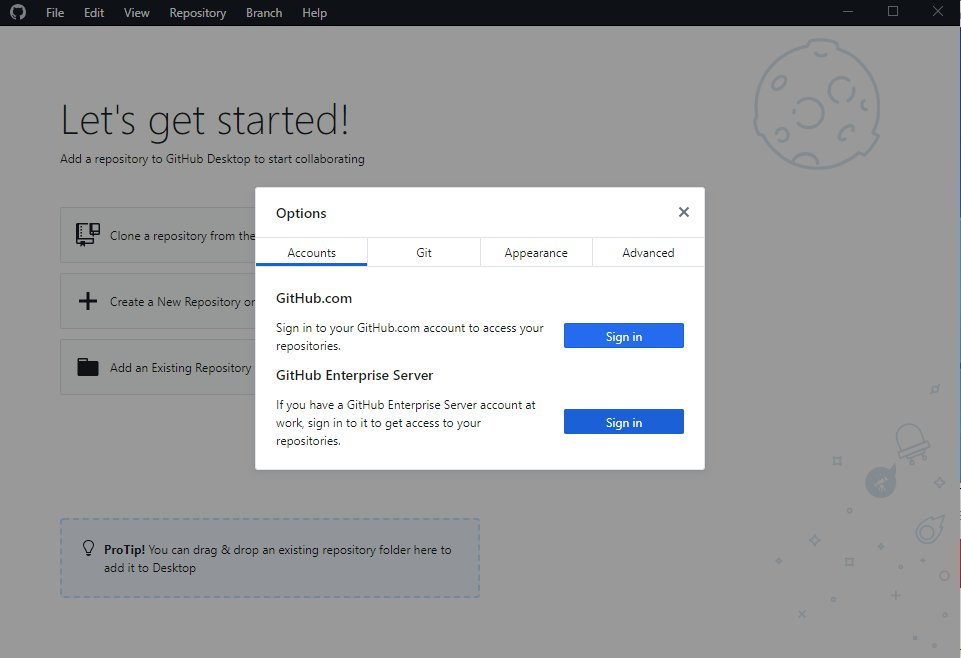
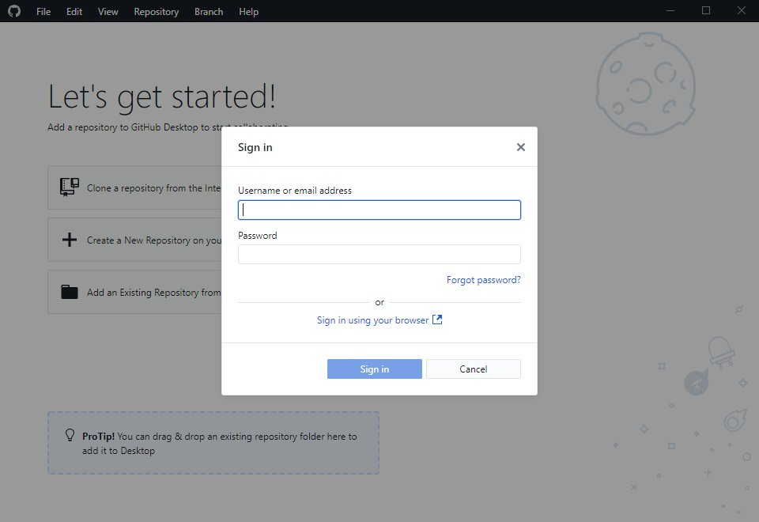
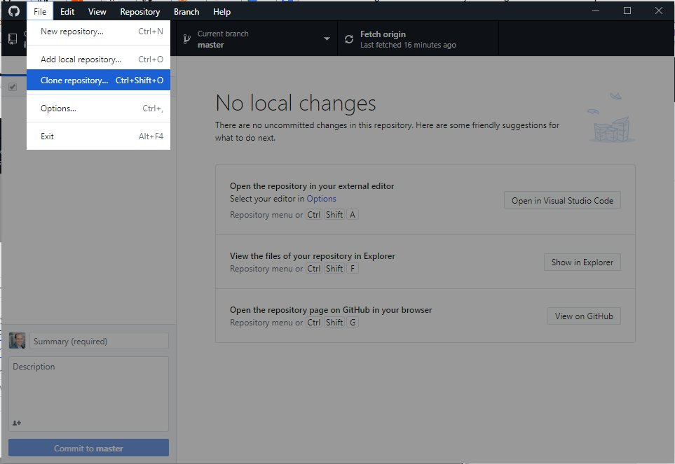
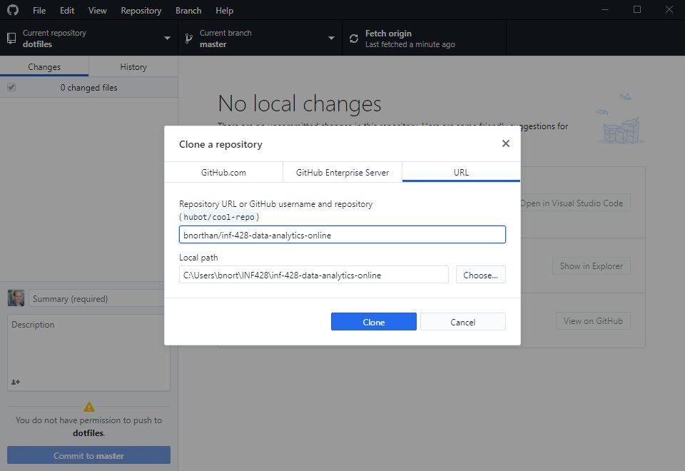

 
<a href=" {{ site.baseurl }}/docs/courses/intro-to-data-analysis/module1/Discussion" class="prev-link">&larr; Previous Page</a> 
<a href=" {{ site.baseurl }}/docs/courses/intro-to-data-analysis/module1/Python" class="next-link">Next Page &rarr;</a> 

## Clone from GitHub

First (if you don't already) create an account on [GitHub](https://github.com/) and install [GitHub desktop](https://desktop.github.com/). (If you are comfortable with the command line, you can interact with git from there... though many students prefer the desk top application)

Once you have GitHub desktop running

### Go to Options

  

###  Sign into your Github account

  
  

###  Go to 'Clone a repository'

###  Choose the 'URL' tab and enter 

Repository URL: bnorthan/inf-428-data-analytics-online

Local Path: __The path where you want to put the repository__

Note: Make sure 'Local Path' is in your user directory (in my case it is C:\Users\bnort\INF428') so you can find the files from Python notebook. 

  

