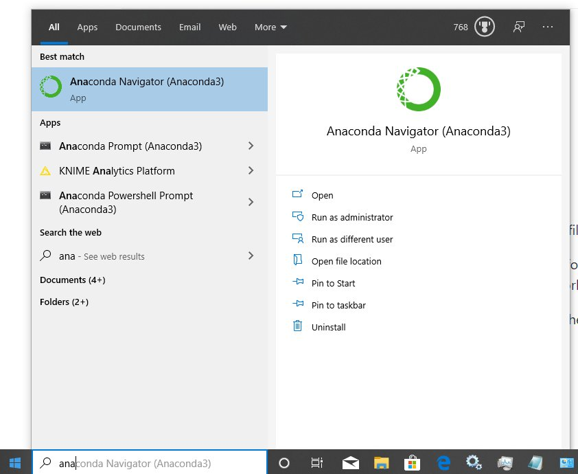

 
<a href=" {{ site.baseurl }}/docs/courses/intro-to-data-analysis/module1/CloneFromGitHub" class="prev-link">&larr; Previous Page</a> 
<a href=" {{ site.baseurl }}/docs/courses/intro-to-data-analysis/module1/PythonReview" class="next-link">Next Page &rarr;</a> 

## Python via Anaconda

Anaconda is a collection of apps for data analysis.  The Anaconda distribution includes Python, the Spyder Interactive Development Environment and Jupyter Notebook among other apps.  

### Install Anaconda with Python 3.7

Note: Make sure you get the version with Python 3.7 (or higher) (NOT 2.7) or the examples will not work. 

[Download here](https://www.anaconda.com/distribution/windows)  
[Instalation instructions on Windows](https://docs.anaconda.com/anaconda/install/windows/)  
[Installing on macOS](https://docs.anaconda.com/anaconda/install/mac-os/)  

### IPython Notebook
* Also known as Jupyter notebook  
* Web based computational environment  
* Lets the user run Python on a web page  
* Divide computional steps into cells.  

## Github

* Join github ([see tutorial](https://product.hubspot.com/blog/git-and-github-tutorial-for-beginners))
* Install [github desktop](https://desktop.github.com/) 
* Watch [Github Desktop for Windows](https://www.youtube.com/watch?v=77W2JSL7-r8) tutorial
* Clone the class github repository following instruction from [here](https://bnorthan.github.io/inf-428-data-analytics-online/Module1/CloneFromGitHub)

### Run IPython notebook 'hello world'

1.  Start Anaconda Navigator  
  
2.  Start Jupyter Notebook  
3.  It will launch in a web browser.  The web-browser should show all the files and directories in your home folder.  
4.  In the web browser browse to the 'inf-428-data-analytics' folder (the folder you cloned from github), then browse to 'python/notebooks/introduction/ and open PythonNotebookHelloWorld.ipynb.   

5.  Alternatively you can get [Python notebook hello world](https://github.com/bnorthan/inf-428-data-analytics-online/blob/master/python/notebooks/introduction/PythonNotebookHelloWorld.ipynb)  directly from the web. 
2.  Run the first cell of the notebook.  

[See Video demonstration](https://www.youtube.com/watch?v=EEEZX_0FMEc) 

If you have any issues, please post on our discussion group. 

