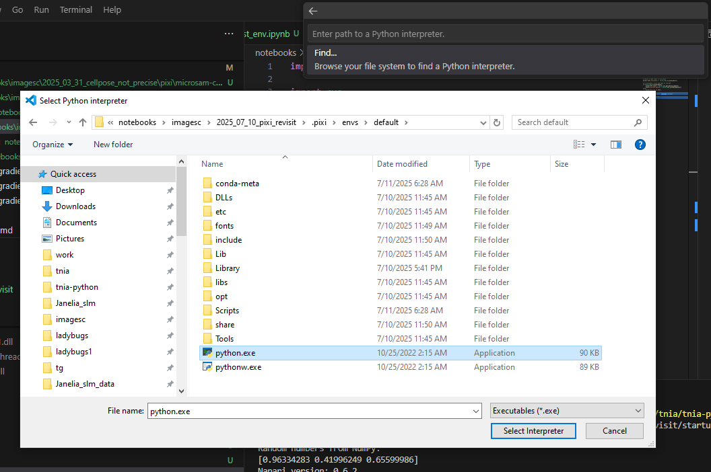

## Load environment in VSCode

To run a script with a pixi created environment

[ctrl][shift][p] to open command pallette   
'Python: Select Interpreter'  
'Enter Interpreter Path'  
'Browse your file system'  

Then (see below screenshot) select Python interpreter

## Install environment as ipykernel to use with Jupyter notebook

pixi run python -m ipykernel install --user --name=mypixi --display-name "Python (mypixi)"